# Kafka Device Sensor Monitoring System

## Overview
A real-time device sensor monitoring system built with Apache Kafka that processes and analyzes sensor data from various devices. The system implements multiple data processing patterns including rolling aggregations, event streaming, and real-time analytics using KSQL.

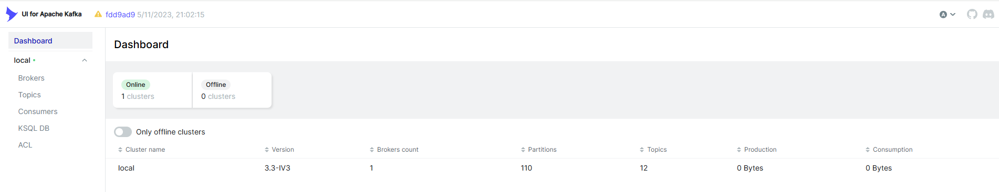

## Prerequisites
- Python 3.9+
- Docker and Docker Compose
- Kafka (Bitnami image 3.3)
- KSQL (Bitnami 7.4)
- Other requirements in requirements.txt

## Installation & Setup

1. Clone the repository:
```bash
git clone <repository-url>
cd kafka-assignment
```

2. Create and activate virtual environment:
```bash
python -m venv venv
# Windows
.\venv\Scripts\activate
# Linux/Mac
source venv/bin/activate
```

3. Install dependencies:
```bash
pip install -r requirements.txt
```

4. Start Kafka cluster and related services:
```bash
make kafka
```

5. Build and run the components:
```bash
# Build images
docker build -t device-producer .
docker build -t device-producer-proto -f Dockerfile.proto .
docker build -t ksql-runner -f Dockerfile.ksql .

# Run components
docker run --network dataeng-network device-producer
docker run --network dataeng-network device-producer-proto
```

## Project Structure
```
kafka-assignment/
├── device_data_faker.py      # Custom faker for device data
├── device_producer.py        # Main Kafka producer
├── device_producer_proto.py  # Protobuf producer
├── device_consumer.py        # Consumer with rolling aggregation
├── device_message.proto     # Protobuf schema definition
├── device_ksql.sql         # KSQL queries
├── requirements.txt        # Python dependencies
└── Dockerfile*            # Docker configurations
```

## Features

### 1. Multi-Partition Topic Management
- Implements 3 partitions for efficient data distribution
- Partition assignment based on device models
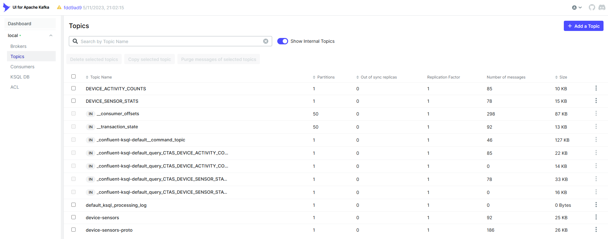

### 2. Custom Data Generation
- Custom faker implementation for device sensor data
- Generates realistic sensor readings (x, y, z coordinates)
- Simulates different device models and activities
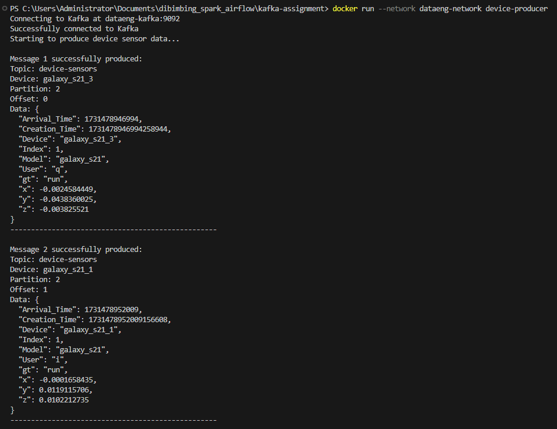

### 3. Real-time Data Processing
- Consumer groups for scalable processing
- Rolling aggregations and statistics calculation
- Real-time monitoring of device activities
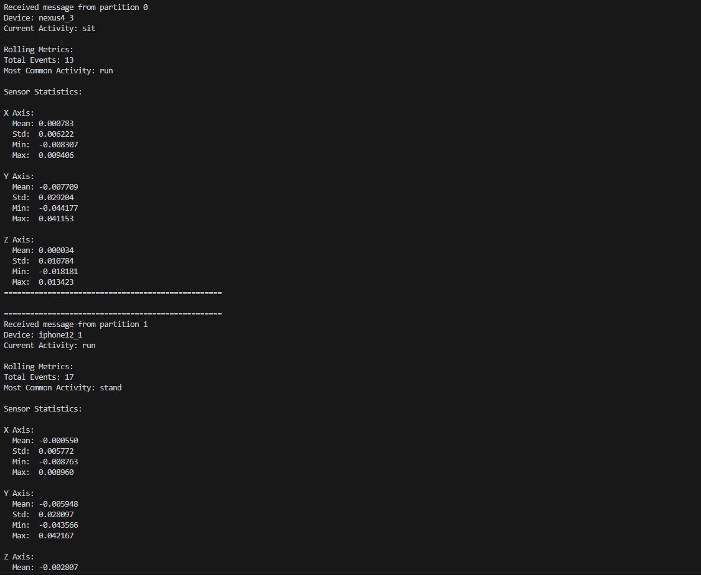

### 4. Schema Management
- Schema Registry implementation
- Protobuf message definition
- Structured data validation
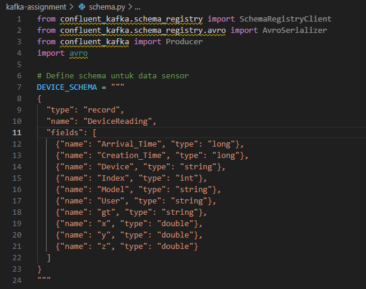
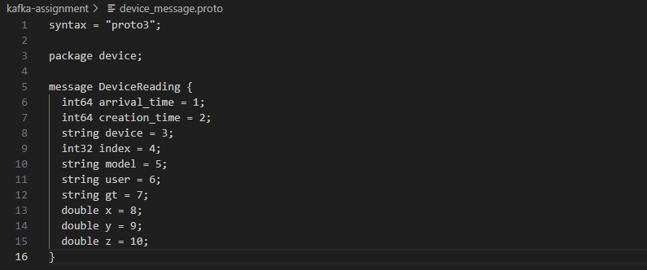

### 5. KSQL Processing
- Real-time stream processing
- Complex event detection
- Activity transition tracking
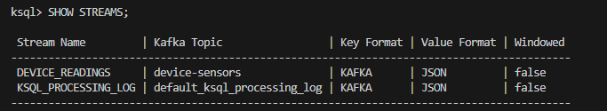
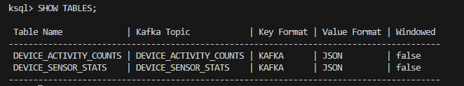
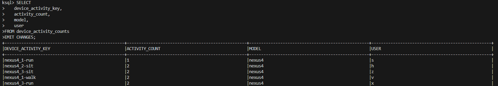

### 6. Monitoring & Analytics
- Message distribution visualization
- Partition balance monitoring
- Real-time metrics dashboard
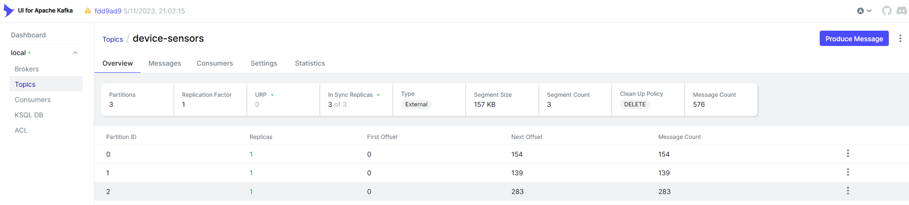

## Technologies Used
- Apache Kafka 3.3
- Python 3.9
- KSQL 7.4
- Protocol Buffers
- Docker
- Kafka UI
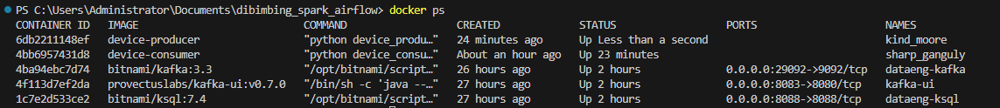

## Documentation

### Producer Components
- `device_data_faker.py`: Generates synthetic device data
- `device_producer.py`: Main Kafka producer implementation
- `device_producer_proto.py`: Protobuf-based producer

### Consumer Components
- `device_consumer.py`: Implements rolling aggregations
- Calculates running statistics (mean, std dev, min/max)
- Tracks activity transitions

### KSQL Queries
```sql
-- Stream definition
CREATE STREAM device_readings (...)

-- Activity tracking
CREATE TABLE device_activity_counts AS...

-- Sensor statistics
CREATE TABLE device_sensor_stats AS...
```

## Project Structure Details
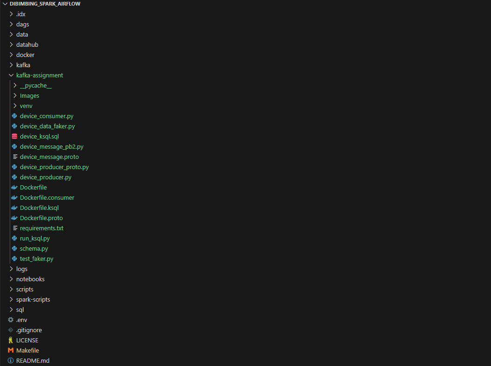

## Monitoring
Access the monitoring interfaces at:
- Kafka UI: http://localhost:8083
- KSQL: http://localhost:8088

## References
- [Apache Kafka Documentation](https://kafka.apache.org/documentation/)
- [KSQL Documentation](https://docs.ksqldb.io/)
- [Protobuf Documentation](https://developers.google.com/protocol-buffers)

## Contributing
1. Fork the repository
2. Create your feature branch
3. Commit your changes
4. Push to the branch
5. Create a new Pull Request
